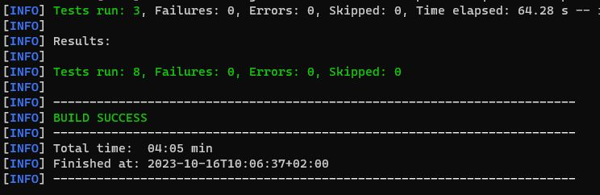

# openproject-selenium-pom-demo
This project demonstrates end-to-end testing of a cloud Software as a Service (SaaS) application using Selenium (Java) Page Object Model.

## System Under Test (SUT)
The SUT chosen for this demo is [OpenProject](https://openproject.org/), an open source project management product. 
OpenProject is available in Community edition (downloadable) and Enterprise edition (cloud hosted or on-premises). 
This project has been developed against the Enterprise Cloud Edition (14-day trial).

## Test Cases
The test cases focus on various project or system configuration scenarios, and verify that configuration changes made 
by an Administrator in one browser session take effect in a separate User browser session.

A few random selected functionalities are used in order to demo the Page Object Model.
Absolutely no claims are made regarding test coverage 
:smile:

### [PublicProjectConfigTests](src/test/java/demo/PublicProjectConfigTests.java)
These tests exercise the 
[Public Project](https://www.openproject.org/docs/user-guide/projects/project-settings/project-information/) 
functionality.

#### Test Case: setProjectPublicThenNonMemberAccessAllowed
<ul>
Verify that when a project Public flag is enabled, then a User that is not a member of the project can access it.
</ul>

#### Test Case: setProjectNotPublicThenNonMemberAccessRefused
<ul>
Verify that when a project Public flag is disabled, then a User that is not a member of the project cannot access it.
</ul>

### [UserProjectRoleTests](src/test/java/demo/UserProjectRoleTests.java)
These tests exercise the 
[Project Role](https://www.openproject.org/docs/system-admin-guide/users-permissions/roles-permissions/#project-role)
functionality

#### Test Case: setUserAsMemberThenWorkPackageCreationAllowed
<ul>
Verify that when a user is assigned the role of member of a project, then they have permission to create a new work package.
</ul>

#### Test Case: setUserAsProjectAdminThenWorkPackageCreationAllowed
<ul>
Verify that when a user is assigned the role of administrator of a project, then they have permission to create a new work package.
</ul>

#### Test Case: setUserAsReaderThenWorkPackageCreationNotAllowed
<ul>
Verify that when a user is assigned the role of reader of a project, then they do not have permission to create a new work package.
</ul>

### [ProjectModulesTests](src/test/java/demo/ProjectModulesTests.java)
These tests exercise the
[Project Modules](https://www.openproject.org/docs/user-guide/projects/project-settings/modules/)
functionality

#### Test Case: addProjectModules
<ul>
Verify that when modules are activated for a project, they are available in the project sidebar menu.
</ul>

#### Test Case: setUserAsReaderThenWorkPackageCreationNotAllowed
<ul>
Verify that when modules are deactivated for a project, they are not available in the project sidebar menu, and neither can be accessed by direct url.
</ul>

### [CustomFieldsTests](src/test/java/demo/CustomFieldsTests.java)
This test exercises the
[Custom Fields](https://www.openproject.org/docs/system-admin-guide/custom-fields/)
functionality

#### Test Case: addAndRemoveCustomFieldInTask
<ul>
Verify that when an Administrator creates a new custom field and adds it to the Task Form Configuration, 
then the custom field is available to an ordinary user.

Verify that the custom field appears in the Task Work Package type, but not in Milestone or Phase.

When the Administrator deletes custom field, it is not available to the User.
</ul>

#### Test Steps
1. Admin: In the Administration > Custom Fields page, create a new custom field
2. Admin: In the Administration > Work Packages >  Types page, add the new custom field to the Task Form Configuration
3. User: In the Work Packages page, create a new Task. Verify the custom field is present and set a value
4. User: Open the new Task and verify custom field and value are displayed
5. User: In the Work Packages page, start creation of a Milestone. Verify the custom field is not present, then cancel
6. User: In the Work Packages page, start creation of a Phase. Verify the custom field is not present, then cancel
7. Admin: In the Administration > Custom Fields page, delete the custom field
8. Admin: In the Administration > Work Packages >  Types page, verify the custom field is not present 
in the Task Form Configuration
9. User: In the Work Packages page, open Task created in step 3. Verify the custom field is not present 

## Page Object Model
Page Object Model (POM) is a popular test framework design pattern that aims to improve maintainability, 
robustness and readability of test automation frameworks.

As the name suggests it entails modelling UI application pages as objects, thus creating an abstraction layer
between the test case logic, and the details of the interaction of the UI automation tool (in this case Selenium) 
with the SUT.

The POM design pattern offers three main advantages:

### Maintainability
Selenium driver code that interacts with the SUT are isolated in the page object methods. 
When changes occur in the SUT that require updates in the Selenium code (e.g. page element locator changes), 
then that change only needs to be applied in one page object method.
Without the POM, where each test case calls the Selenium code directly, the same change may need to be replicated
in dozens of test cases.

### Robustness

### Readability
The test case code tends to be more concise , with references to well-named classes and methods making the 
intent and flow of the test case much clearer, as can be seen from this snippet:

```
        // User: try to access the non-public project
        userDriver.get("https://" + config.getDomainName() + 
                ".openproject.com/projects/" + config.getTestProjectId());

        // verify access not allowed
        String expectedErrorMessage = "[Error 403] You are not authorized to access this page.";
        ToastPage toastPage = new ToastPage(userDriver);
        String toastText = toastPage.getText();
        toastPage.closeToast();
        assertThat(toastText).isEqualTo(expectedErrorMessage);
```

## Project Structure
Overview of different code components

## Execution

### Prerequisites
Maven is required to execute the tests in this project. 

### Configuration
Before running the tests, you will need to configure the following properties in [config.properties](config.properties):
```
# These properties need to be set
domainName=
adminUser=
adminPassword=
adminApiKey=
```
Refer to [API v3 usage example | Basic Auth](https://www.openproject.org/docs/api/example/#basic-auth)
for API key generation.

### Test Execution
To run the tests, execute the following command in the project root folder
```
mvn test
```

The tests should take no more then a couple of minutes to run, and display the following results:



